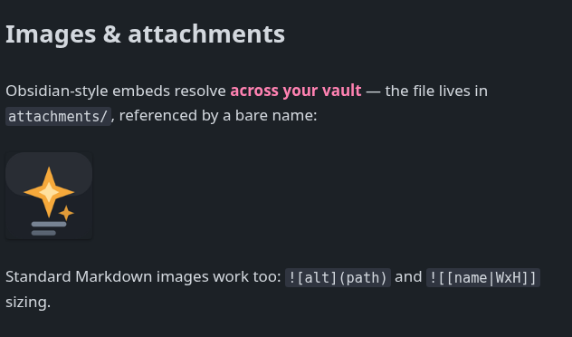

<div align="center">


# Flintmark

**Obsidian-style Markdown Live Preview for VS Code.**

English · [简体中文](README.zh-CN.md)

[](https://github.com/quboliu/Flintmark/releases)
[](LICENSE)

</div>


Flintmark renders Markdown in place as you type: the line under the cursor keeps
its raw syntax, everything else renders. No source/preview split, and the file on
disk stays plain, standard Markdown.

## Features

### Live Preview

Headings, emphasis, inline code, quotes, lists, and task checkboxes render inline.
Put the cursor on a line to edit its raw Markdown; move away and it renders again.


### Callouts

The full Obsidian callout set — `[!note]`, `[!tip]`, `[!warning]`, `[!important]`,
`[!abstract]`, `[!todo]`, … — with custom or auto-generated titles.


### Syntax-highlighted code

30+ languages — JS/TS, Python, Rust, Go, **SQL**, Shell, C/C++, C#, Java, PHP,
Ruby, Kotlin, Swift, YAML, TOML, Dockerfile, and more — each block tagged with its
language.


### Tables

Rendered as HTML and **editable in place** — click a cell, type, commit.


### Math & diagrams

Inline and block math via [KaTeX](https://katex.org/); [Mermaid](https://mermaid.js.org/)
diagrams, lazy-loaded so they cost nothing until one appears.


### Wikilinks, tags, highlights, footnotes

`[[wikilinks]]`, `#tags`, `==highlights==`, `[^footnotes]` (superscript), and
`%% comments %%` (hidden in preview).


### Images & attachments

Local images and Obsidian embeds render inline. `![[image.png]]` resolves **across
your vault** — keep attachments in any folder and reference them by bare name, just
like Obsidian — and `![[image.png|200]]` / `|200x120` sizes them.



### Outline & Backlinks

A dedicated side container. VS Code's built-in Outline can't see webview editors,
so Flintmark ships its own — plus Backlinks for the active note.


### Reuse your editor's AI

Flintmark ships **no AI of its own**. A webview editor hides its selection from the
host, so Copilot / Cursor can't see what you select in Live Preview. The selection
bridge fixes that — select text, then:


- **✨ Edit** — relocates the selection into the real source editor and triggers the
  host's inline AI (Copilot inline chat, Cursor `⌘K`).
- **💬 Add to Chat** — sends the selection to the host's AI chat / composer.

Command IDs are detected per host (verified on VS Code + Copilot, Cursor, and
VSCodium) and overridable via settings. Run **Flintmark: Show AI Log** to trace the
hand-off if a host's commands differ.

## Install

Download `flintmark-<version>.vsix` from the
[Releases](https://github.com/quboliu/Flintmark/releases) page, then install it —
in VS Code: **Extensions → ⋯ → Install from VSIX…**, or from a terminal:

```
code --install-extension flintmark-0.28.0.vsix
```

Open any `.md` file and accept the prompt to make Live Preview the default, or run
**Flintmark: Switch to Live View**. Toggle back any time with **Switch to Code View**.

### Set as the default Markdown editor

Missed the first-run prompt? Set it any time — open the Command Palette and run
**Flintmark: Set Live Preview as Default Markdown Editor**. Or add to your settings:

```json
"workbench.editorAssociations": { "*.md": "ofm.livePreview", "*.markdown": "ofm.livePreview" }
```

## Settings

| Setting | Default | Description |
| --- | --- | --- |
| `ofm.theme` | `things` | Bundled Live Preview theme. |
| `ofm.lineWidth` | `75` | Readable column width, in `rem`. Larger = wider text, smaller margins. |
| `ofm.fontFamily` | _(theme)_ | Prose font (body + headings) for rendered Markdown, independent of the editor font. Empty = theme / UI font. |
| `ofm.fontSize` | `0` | Prose font size in px. `0` = editor font size + 2px. |
| `ofm.monospaceFontFamily` | _(editor)_ | Code font (fenced blocks, inline code, frontmatter). Empty = editor font. |
| `ofm.ai.chatBridge` | `split` | How *Add to Chat* relocates the selection (`split` keeps the Live tab; `inplace` flips it). |
| `ofm.ai.sourceLayout` | `replace` | Where *Edit* opens the source (`replace` / `beside`). |
| `ofm.ai.trigger` | `auto` | Auto-trigger the native inline AI, or `manual`. |
| `ofm.ai.chatCommand`, `ofm.ai.triggerCommand` | _(auto)_ | Override the native command IDs for your host. |

## Disclaimer

Not affiliated with, endorsed by, or sponsored by Obsidian or Dynalist Inc.
"Obsidian" is a trademark of Dynalist Inc., referenced here only descriptively to
state Markdown/visual compatibility.

## Credits

- **Things** theme — © Stephan Ango ([@kepano](https://github.com/kepano)), Obsidian
  port by Colin Eckert ([@colineckert](https://github.com/colineckert)). Bundled as
  the default theme, vendored verbatim under the MIT License
  ([source](https://github.com/colineckert/obsidian-things)). Full notice:
  [THIRD-PARTY-NOTICES.md](THIRD-PARTY-NOTICES.md).
- Built on [CodeMirror 6](https://codemirror.net/), [Lezer](https://lezer.codemirror.net/),
  [KaTeX](https://katex.org/), and [Mermaid](https://mermaid.js.org/).

## License

[MIT](LICENSE) © quboliu. Bundled third-party software: see
[THIRD-PARTY-NOTICES.md](THIRD-PARTY-NOTICES.md).
