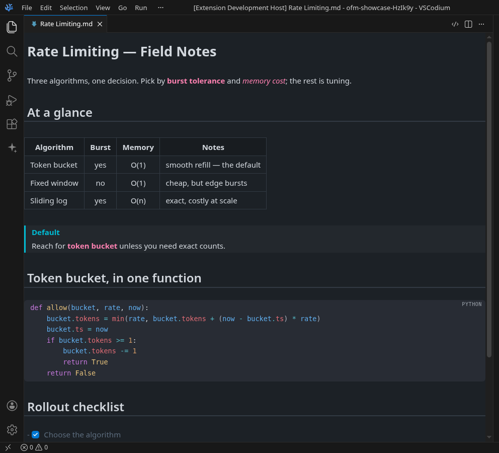
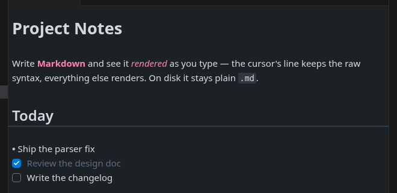
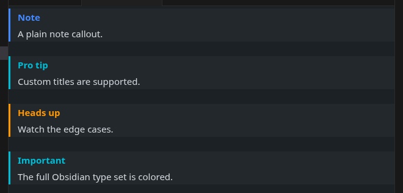
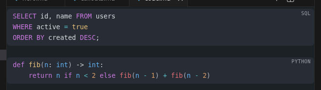
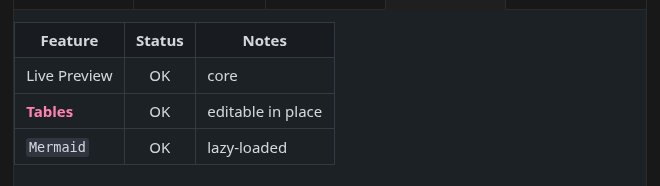
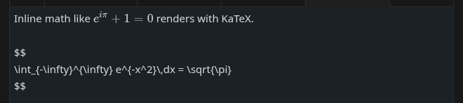
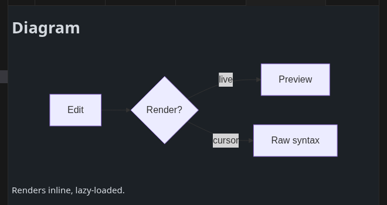
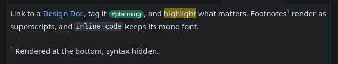
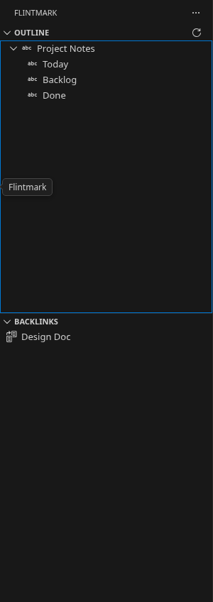
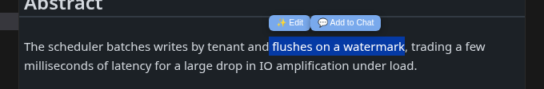

<div align="center">


# Flintmark

**VS Code 里的 Obsidian 式 Markdown 实时预览。**

[English](README.md) · 简体中文

[](https://github.com/quboliu/Flintmark/releases)
[](LICENSE)

</div>



Flintmark 在你输入时原地渲染 Markdown:光标所在行保留原始语法,其余实时渲染。
没有「源码 / 预览」分屏,磁盘上始终是标准 Markdown 纯文本。

## 功能

### 实时预览

标题、强调、行内代码、引用、列表、任务复选框原地渲染。光标移到某行即可编辑其原始
Markdown,移开后重新渲染。



### Callout

完整的 Obsidian callout 类型 —— `[!note]`、`[!tip]`、`[!warning]`、`[!important]`、
`[!abstract]`、`[!todo]` …… —— 支持自定义标题,无标题时自动用类型名。



### 代码块语法高亮

30+ 种语言 —— JS/TS、Python、Rust、Go、**SQL**、Shell、C/C++、C#、Java、PHP、
Ruby、Kotlin、Swift、YAML、TOML、Dockerfile 等 —— 每个代码块标注语言。



### 表格

渲染为 HTML 并**支持原地编辑** —— 点击单元格,输入,提交。



### 公式与图表

行内 / 块级公式由 [KaTeX](https://katex.org/) 渲染;[Mermaid](https://mermaid.js.org/)
图表按需懒加载,文档里没有图表时零开销。





### Wikilink、标签、高亮、脚注

`[[wikilink]]`、`#标签`、`==高亮==`、`[^脚注]`(上标),以及 `%% 注释 %%`(预览中隐藏)。



### 大纲与反向链接

独立的侧边容器。VS Code 自带的大纲看不到 webview 编辑器,因此 Flintmark 自带大纲,
另附当前笔记的反向链接(Backlinks)。



### 复用编辑器的原生 AI

Flintmark **不自带 AI**。webview 编辑器会对宿主隐藏选区,因此 Copilot / Cursor 看不到你
在实时预览里选中的内容。选区桥接解决了这一点 —— 选中文本后:



- **✨ Edit** —— 把选区搬回真实源码编辑器,并触发宿主的行内 AI(Copilot inline chat、
  Cursor `⌘K`)。
- **💬 Add to Chat** —— 把选区送进宿主的 AI 对话 / composer。

命令 ID 按宿主自动探测(已在 VS Code + Copilot、Cursor、VSCodium 上验证),也可在设置里
覆盖。若某宿主命令不同,运行 **Flintmark: Show AI Log** 可追踪每一跳的交接。

## 安装

在 Marketplace 搜索 **Flintmark**,或:

```
code --install-extension quboliu.obsidian-flavored-markdown
```

打开任意 `.md`,在提示中将实时预览设为默认,或运行 **Flintmark: Switch to Live View**。
随时用 **Switch to Code View** 切回源码。

## 设置

| 设置项 | 默认 | 说明 |
| --- | --- | --- |
| `ofm.theme` | `things` | 内置实时预览主题。 |
| `ofm.lineWidth` | `75` | 可读列宽,单位 `rem`。越大正文越宽、页边距越小。 |
| `ofm.ai.chatBridge` | `split` | *Add to Chat* 如何搬运选区(`split` 保留实时预览标签;`inplace` 翻转当前标签)。 |
| `ofm.ai.sourceLayout` | `replace` | *Edit* 在何处打开源码(`replace` / `beside`)。 |
| `ofm.ai.trigger` | `auto` | 自动触发原生行内 AI,或 `manual`。 |
| `ofm.ai.chatCommand`、`ofm.ai.triggerCommand` | _(自动)_ | 为你的宿主覆盖原生命令 ID。 |

## 声明

本项目与 Obsidian / Dynalist Inc. **无任何隶属关系**,非官方产品。「Obsidian」是
Dynalist Inc. 的商标,此处仅作兼容性的指称性使用。

## 致谢

- **Things** 主题 —— © Stephan Ango([@kepano](https://github.com/kepano)),Obsidian
  移植版由 Colin Eckert([@colineckert](https://github.com/colineckert))维护。按 MIT
  协议**逐字内置**为默认主题([源](https://github.com/colineckert/obsidian-things))。
  完整声明见 [THIRD-PARTY-NOTICES.md](THIRD-PARTY-NOTICES.md)。
- 基于 [CodeMirror 6](https://codemirror.net/)、[Lezer](https://lezer.codemirror.net/)、
  [KaTeX](https://katex.org/)、[Mermaid](https://mermaid.js.org/)。

## 许可

[MIT](LICENSE) © quboliu。内置第三方软件见
[THIRD-PARTY-NOTICES.md](THIRD-PARTY-NOTICES.md)。
