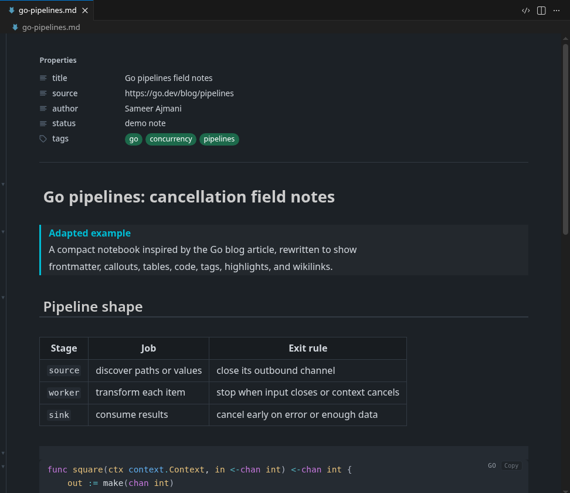
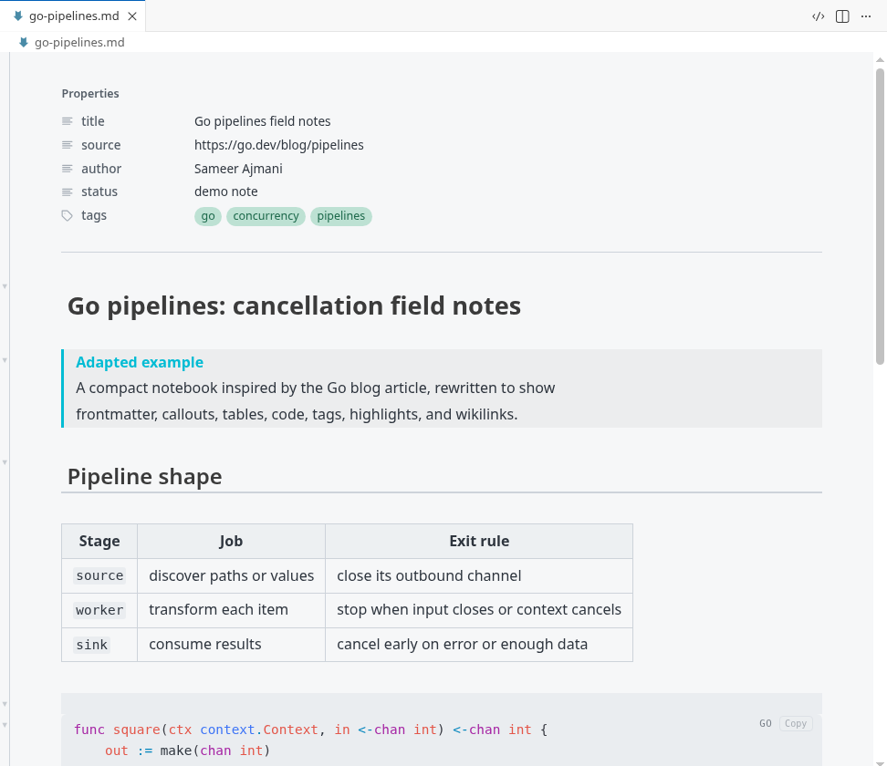

<div align="center">


# Flintmark

**VS Code 里的 Obsidian 风格 Markdown 实时预览。**

[English](README.md) · 简体中文

[](https://github.com/quboliu/Flintmark/releases)
[](LICENSE)

</div>

Flintmark 让 Markdown 在编辑器里直接“活起来”：光标所在行保留原始语法，方便你继续写；
其他内容自动渲染成接近成稿的样子。没有源码/预览分屏，也不会生成额外文件，磁盘上仍然是
普通 Markdown。

## 预览

下面这组截图使用同一篇演示笔记。内容参考了 Go 官方博客的
[Go Concurrency Patterns: Pipelines and cancellation](https://go.dev/blog/pipelines)，
但不是照搬原文，而是改写成一篇适合展示 Flintmark 的技术笔记：包含 frontmatter、
callout、表格、Go 代码、标签、高亮和 wikilink。

**深色主题**



**浅色主题**



## 主要能力

| 方面 | Flintmark 支持什么 |
| --- | --- |
| 实时预览 | 标题、强调、行内代码、引用、列表、任务、wikilink、标签、高亮、注释、脚注、表格、公式、图表和图片都在编辑器里原地渲染。 |
| 写作手感 | 光标移到某一行时显示原始 Markdown，移开后恢复预览。加粗、斜体、行内代码、删除线和链接都有快捷键；选中文字后粘贴 URL 会自动变成 Markdown 链接。 |
| Frontmatter | YAML frontmatter 会显示成 Properties 面板，列表和标签会变成 chips；解析不了的复杂 YAML 会退回为变暗的原始文本。 |
| 代码块 | 30 多种 fenced code 语言高亮，包括 JS/TS、Python、Rust、Go、SQL、Shell、C/C++、C#、Java、PHP、Ruby、Kotlin、Swift、YAML、TOML、Dockerfile 等。渲染后的代码块自带 Copy 按钮。 |
| 表格 | GFM 表格渲染为 HTML 表格，也可以直接点进单元格编辑。 |
| 图片和附件 | 本地图片、Obsidian embed 都能原地显示。`![[image.png]]` 会在整个 vault 里解析；粘贴或拖入图片时，Flintmark 会保存文件并插入引用。 |
| 导航 | `[[` 补全库内笔记，`#` 补全标签，`[[#` 补全当前笔记标题。由于 VS Code 自带 Outline 看不到 webview 编辑器，Flintmark 也提供了自己的大纲和反向链接视图。 |
| 主题 | 跟随 VS Code 的深色、浅色和高对比主题。切换主题时不会重建编辑器，所以光标和滚动位置都能保住。 |

## Obsidian 常用语法

Flintmark 重点照顾 Obsidian 风格 vault 里最常见的写法：

- `[[wikilinks]]`，包括点击未解析链接创建新笔记。
- `#tags`、`==高亮==`、预览里隐藏的 `%% 注释 %%`。
- `[!note]`、`[!tip]`、`[!warning]`、`[!important]`、`[!todo]` 等常见 callout。
- GitHub Markdown 之外的任务状态：`[/]` 进行中、`[-]` 已取消、`[>]` 已转交、`[?]` 待确认。
- 带尺寸的图片 embed：`![[image.png|200]]` 或 `![[image.png|200x120]]`。

## 复用编辑器里的 AI

Flintmark 自己不带 AI。问题在于：webview 编辑器里的选区，宿主编辑器通常看不见，所以
Copilot、Cursor 这类工具没法直接拿到你在实时预览里选中的内容。Flintmark 做了一层桥接：

- **Edit**：把选区搬回真实源码编辑器，并触发宿主的行内 AI 命令。
- **Add to Chat**：把选区送进宿主的聊天或 composer。

命令 ID 会按宿主自动探测，也可以在设置里覆盖。遇到某个宿主命令不匹配时，运行
**Flintmark: Show AI Log** 可以看到每一步交接。

## 安装

到 [GitHub Releases](https://github.com/quboliu/Flintmark/releases) 下载
`flintmark-<version>.vsix`，然后在 VS Code 里通过
**Extensions -> ... -> Install from VSIX...** 安装；也可以用命令行：

```sh
code --install-extension flintmark-0.32.6.vsix
```

打开任意 `.md` 文件，按提示把 Flintmark 设为默认 Markdown 编辑器；也可以从命令面板运行
**Flintmark: Switch to Live View**。需要源码视图时，随时用 **Switch to Code View** 切回去。

### 设为默认 Markdown 编辑器

如果错过了第一次提示，可以运行
**Flintmark: Set Live Preview as Default Markdown Editor**，或者直接写入设置：

```json
"workbench.editorAssociations": {
  "*.md": "ofm.livePreview",
  "*.markdown": "ofm.livePreview"
}
```

## 设置

| 设置项 | 默认值 | 说明 |
| --- | --- | --- |
| `ofm.theme` | `things` | 内置实时预览主题。 |
| `ofm.lineWidth` | `0` | `0` 表示填满编辑器宽度并保留固定边距；`20`-`240` 表示居中限制为对应 `rem` 宽度。 |
| `ofm.fontFamily` | _(主题)_ | 渲染后正文使用的字体，独立于编辑器字体。 |
| `ofm.fontSize` | `0` | 渲染后正文的字号，单位 px。`0` 表示编辑器字号 + 2px。 |
| `ofm.monospaceFontFamily` | _(编辑器)_ | 代码块、行内代码和 frontmatter 使用的等宽字体。 |
| `ofm.ai.chatBridge` | `split` | Add to Chat 如何搬运选区：`split` 保留 Live 标签，`inplace` 翻转当前标签。 |
| `ofm.ai.sourceLayout` | `replace` | Edit 在哪里打开源码编辑器：`replace` 或 `beside`。 |
| `ofm.ai.trigger` | `auto` | 自动触发宿主行内 AI，或设为手动。 |
| `ofm.ai.chatCommand`、`ofm.ai.triggerCommand` | _(自动)_ | 为当前宿主覆盖原生命令 ID。 |

## 演示笔记来源

截图使用的 Markdown 文件在
[media/demo/go-pipelines.md](media/demo/go-pipelines.md)。它只是基于 Go blog 文章思路重写的
展示样例，不是原文镜像。

## 声明

本项目与 Obsidian / Dynalist Inc. 没有隶属、赞助或背书关系。“Obsidian” 是 Dynalist Inc.
的商标，这里只用于说明 Markdown 语法和视觉兼容性。

## 致谢

- **Things** 主题 - © Stephan Ango（[@kepano](https://github.com/kepano)），Obsidian
  移植版由 Colin Eckert（[@colineckert](https://github.com/colineckert)）维护。Flintmark
  将它作为默认主题随包内置，遵循 MIT License
  （[source](https://github.com/colineckert/obsidian-things)）。完整声明见
  [THIRD-PARTY-NOTICES.md](THIRD-PARTY-NOTICES.md)。
- 基于 [CodeMirror 6](https://codemirror.net/)、
  [Lezer](https://lezer.codemirror.net/)、[KaTeX](https://katex.org/) 和
  [Mermaid](https://mermaid.js.org/)。

## 许可

[MIT](LICENSE) © quboliu。内置第三方软件见
[THIRD-PARTY-NOTICES.md](THIRD-PARTY-NOTICES.md)。
