<p align="center">
  
</p>

<h1 align="center">Flintmark</h1>

<p align="center">
  <strong>写下去是 Markdown，读起来已经接近成稿。</strong><br>
  在 VS Code 里获得 Obsidian 风格实时预览、知识库导航和原生 AI 交接。
</p>

<p align="center">
  <a href="README.md">English</a> · <strong>简体中文</strong>
</p>

<p align="center">
  <a href="#产品导览">产品导览</a> ·
  <a href="#flintmark-能读懂什么">支持语法</a> ·
  <a href="#安装">安装</a> ·
  <a href="#设置">设置</a> ·
  <a href="#开发">开发</a>
</p>

<p align="center">
  <a href="https://github.com/quboliu/flintmark/actions/workflows/ci.yml"></a>
  <a href="https://github.com/quboliu/flintmark/releases"></a>
  <a href="https://marketplace.visualstudio.com/items?itemName=quboliu.flintmark"></a>
  
  <a href="LICENSE"></a>
</p>

Flintmark 直接把 Markdown 编辑器变成预览：光标所在的行或区块显露源码语法，文档的其他
部分保持渲染后的阅读状态。不需要源码/预览分屏，不生成私有数据库，也不复制一份预览文件；
磁盘上的普通 `.md` 始终是唯一事实来源。

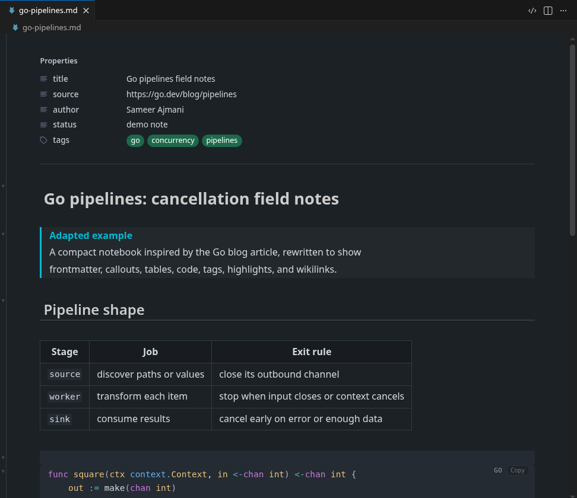

## 为什么用 Flintmark

| 原则 | 实际体验 |
| --- | --- |
| 在上下文里编辑 | 光标移到渲染内容上，原始 Markdown 就在当前位置出现。 |
| 知识库保持可迁移 | 笔记、链接、frontmatter、任务和 embed 在磁盘上仍是普通 Markdown。 |
| 把 Obsidian 的常用能力带进来 | Wikilink、callout、Properties、任务状态、标签、高亮、跨库图片、Outline、Todo 和 Backlinks 都留在 VS Code 里。 |
| 复用已有工具 | 实时预览里的选区可以交给 VS Code / Cursor 自带的 AI 编辑和聊天命令。 |
| 大库打开也不挡住写作 | 工作区索引分片构建，保存时增量更新；即使自动补全还在准备，编辑器也会先显示出来。 |

## 产品导览

下面的截图都来自真实扩展运行在 VS Code 兼容工作台中的效果，不是 HTML 模型图。

### 一个编辑器，两种状态

文档平时保持渲染；只有光标进入某一行或区块时才显示对应源码。标题、列表、callout、
表格、代码、公式和媒体因此可以在同一个位置阅读与修改，不用来回切换视图。

<table>
  <tr>
    <td width="50%"></td>
    <td width="50%">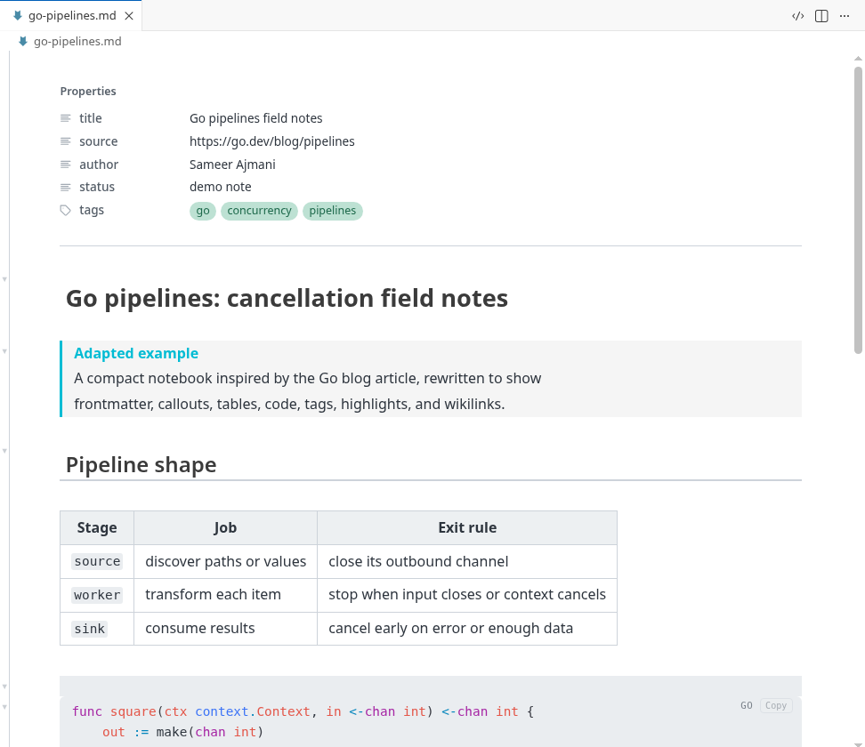</td>
  </tr>
  <tr>
    <td align="center"><strong>深色</strong>——跟随当前工作台主题</td>
    <td align="center"><strong>浅色</strong>——原地切换，不重建编辑器</td>
  </tr>
</table>

### 不离开实时预览也能完整写作

渲染后的任务状态可以点击，代码块保留语法高亮和 Copy 操作，活动行则直接显露原始
Markdown。加粗、斜体、行内代码、删除线和链接都有快捷键；选中文字再粘贴 URL，会自动
生成 Markdown 链接。

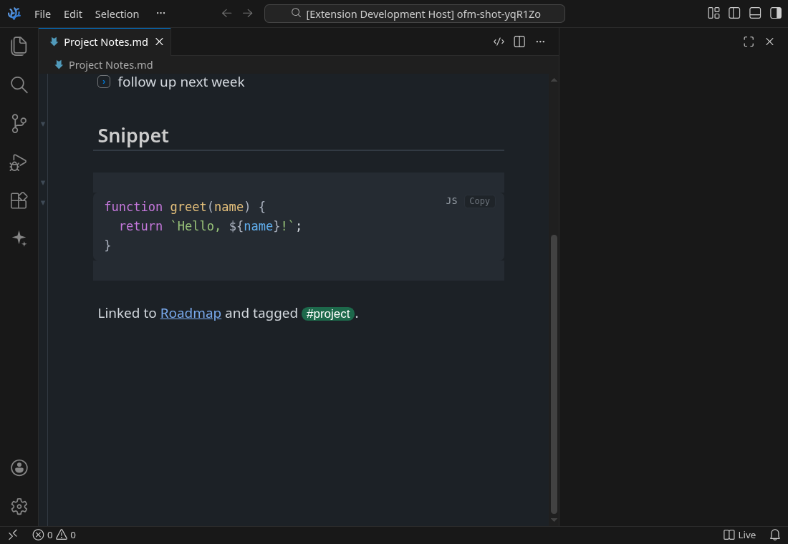

输入 `[[` 补全知识库笔记，输入 `#` 补全全库标签，输入 `[[#` 补全当前笔记标题。
文件变化后补全数据会自动更新，不会重建编辑器，也不会丢失选区。

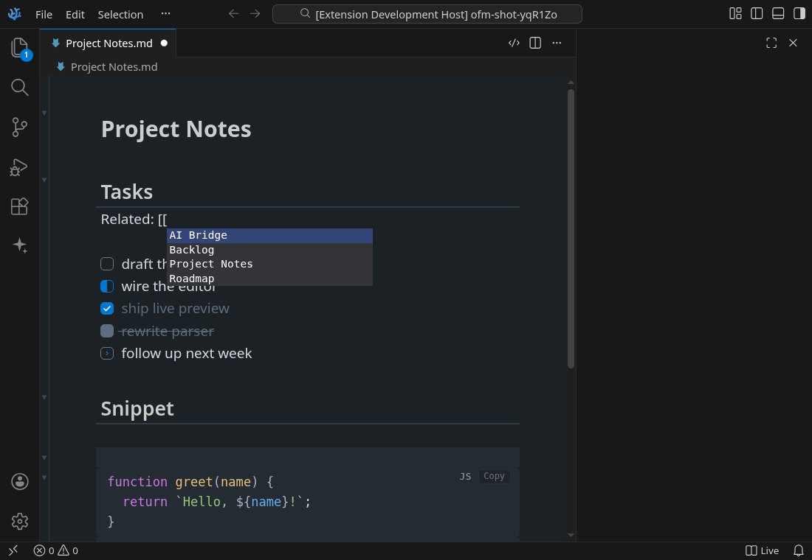

### Frontmatter 变成 Properties

简单 YAML frontmatter 会渲染成紧凑的 Properties 面板，自动推断类型图标，并把数组和
标签显示成 chips。点击面板即可显露和编辑 YAML；复杂 YAML 会安全退回源码显示，避免
用错误的界面误读数据。

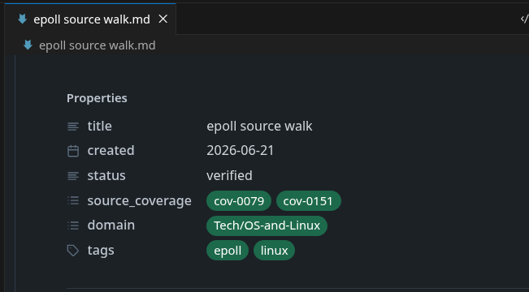

### 同时导航文档与知识库

Webview 编辑器无法直接复用 VS Code 内置 Markdown Outline，因此 Flintmark 提供自己的
嵌套标题 **Outline**、聚合标准和扩展任务状态的实时 **Todo**，以及全库 **Backlinks**。
点击标题或任务即可跳到实时预览里的准确源码行。

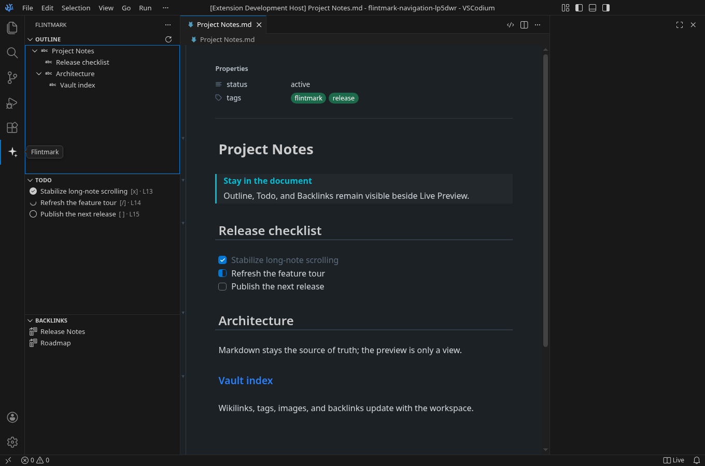

### 丰富 Markdown 就在原位渲染

<table>
  <tr>
    <td width="50%">
      <strong>Callout</strong><br>
      常见 Obsidian 类型和别名拥有各自的标题与颜色。<br><br>
      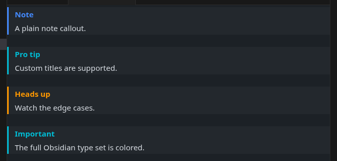
    </td>
    <td width="50%">
      <strong>任务状态</strong><br>
      除 GFM 任务外，还支持进行中、取消、转交和待确认。<br><br>
      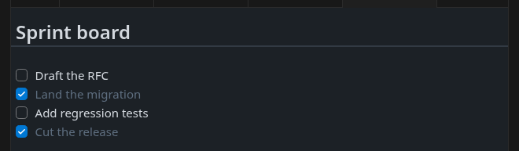
    </td>
  </tr>
  <tr>
    <td width="50%">
      <strong>代码语法高亮</strong><br>
      30 多种 fenced code 语言、语言标签和 Copy 操作。<br><br>
      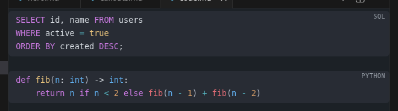
    </td>
    <td width="50%">
      <strong>可编辑的 GFM 表格</strong><br>
      渲染后的单元格保留强调、代码、链接和高亮。<br><br>
      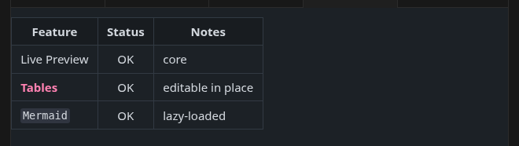
    </td>
  </tr>
  <tr>
    <td width="50%">
      <strong>KaTeX 公式</strong><br>
      行内公式，以及单行或多行块公式，都能原位渲染。<br><br>
      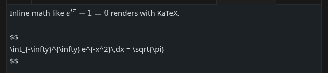
    </td>
    <td width="50%">
      <strong>Mermaid 图表</strong><br>
      Mermaid 按需加载，进入编辑时回到源码。<br><br>
      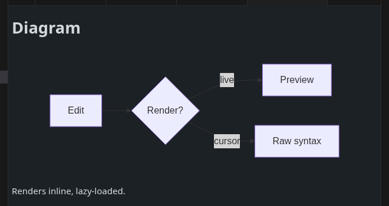
    </td>
  </tr>
  <tr>
    <td width="50%">
      <strong>Obsidian 风格行内语法</strong><br>
      Wikilink、标签、高亮、脚注、注释和行内代码。<br><br>
      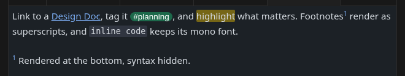
    </td>
    <td width="50%">
      <strong>图片与附件</strong><br>
      标准图片和跨库 <code>![[embed]]</code>，也支持明确指定尺寸。<br><br>
      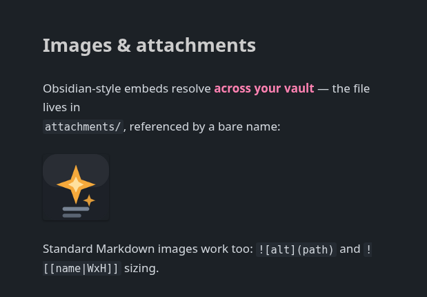
    </td>
  </tr>
</table>

Flintmark 还支持经过清理的内联 SVG、引用、有序/无序列表、分隔线、Setext 标题、脚注定义、
预览中隐藏的 `%% 注释 %%`，以及标准 Markdown 链接和图片。

### 粘贴或拖入附件

把图片粘贴或拖进笔记，Flintmark 会将文件保存到 Markdown 旁边，插入经过安全处理的
`![[name.ext]]` embed，避免覆盖重名文件，并对不支持或过大的内容给出可见提示。
裸图片名可以解析到知识库深层附件目录；`![[image.png|200]]` 和
`![[image.png|200x120]]` 可以控制显示尺寸。

### 复用编辑器自带的 AI

Flintmark 不另外提供 AI 服务，而是把实时预览 Webview 里的选区交回真实源码编辑器：

- **Edit**：打开对应的源码选区，并可继续触发宿主的行内 AI 命令。
- **Add to Chat**：把同一选区附加到宿主的聊天或 composer。

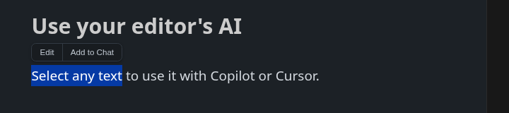

VS Code 和 Cursor 的命令 ID 会自动识别，也可以在设置中针对其他宿主覆盖。自定义宿主集成
有问题时，运行 **Flintmark: Show AI Log** 查看交接过程。

## 当前能力

| 范围 | 已实现行为 |
| --- | --- |
| 实时预览 | 光标驱动源码显露；标题、强调、链接、列表、引用、callout、任务、表格、代码、公式、Mermaid、SVG、图片和 embed 原位渲染 |
| 编辑 | Markdown 格式快捷键、URL 智能粘贴、任务切换、代码 Copy、查找/替换、标题折叠、实时视图 ↔ 源码视图切换 |
| 元数据 | 简单 YAML 显示为 Obsidian 风格 Properties；复杂 YAML 安全退回原始源码 |
| 知识库 | Wikilink/标签/标题补全、点击未解析链接创建笔记、跨库图片解析、Outline、Todo 和 Backlinks |
| 附件 | 图片粘贴/拖入、安全文件名、避免重名覆盖、大小限制、标准 Markdown 图片、`![[embed|W]]` 与 `![[embed|WxH]]` |
| 主题 | 内置 Things 主题；实时适配深色、浅色和高对比模式；自定义正文/等宽字体和阅读宽度 |
| AI 交接 | 将选区交给宿主原生行内编辑和聊天；自动识别宿主，也可覆盖命令并输出诊断日志 |
| 可靠性 | 串行文档同步、合并结构刷新、协作式/增量知识库索引、富区块精确测量，以及真实工作台 E2E 覆盖 |

## Flintmark 能读懂什么

- `[[wikilink]]`、别名、标题/块锚点，以及点击未解析链接创建笔记。
- `#标签`、`==高亮==`、脚注和预览中隐藏的 `%% 注释 %%`。
- `[!note]`、`[!tip]`、`[!warning]`、`[!important]`、`[!todo]`、
  `[!abstract]`、`[!failure]` 等 callout 及常见别名。
- 标准 `[ ]` / `[x]` 任务，以及 `[/]` 进行中、`[-]` 已取消、`[>]` 已转交、
  `[?]` 待确认。
- YAML frontmatter、GFM 表格、fenced code、行内/块公式、Mermaid、经过清理的内联 SVG、
  Markdown 图片和 Obsidian 图片 embed。

## 安装

从 [VS Code Marketplace](https://marketplace.visualstudio.com/items?itemName=quboliu.flintmark)
安装，在扩展视图搜索 **Flintmark**，或运行：

```sh
code --install-extension quboliu.flintmark
```

手动安装时，从 [GitHub Releases](https://github.com/quboliu/flintmark/releases)
下载 `flintmark-<version>.vsix`，再选择
**Extensions → … → Install from VSIX…**。

打开 `.md` 文件后接受提示，将 Flintmark 设为默认 Markdown 编辑器；也可以运行
**Flintmark: Switch to Live View**。需要传统源码编辑器时，运行 **Switch to Code View**。

### 设为默认实时预览

运行 **Flintmark: Set Live Preview as Default Markdown Editor**，或添加：

```json
"workbench.editorAssociations": {
  "*.md": "ofm.livePreview",
  "*.markdown": "ofm.livePreview"
}
```

## 设置

| 设置项 | 默认值 | 用途 |
| --- | --- | --- |
| `ofm.theme` | `things` | 内置实时预览主题。 |
| `ofm.lineWidth` | `0` | `0` 表示填满窗格并保留稳定边距；`20`–`240` 表示居中限制为对应 `rem` 宽度。 |
| `ofm.fontFamily` | 主题 | 渲染正文的字体，与源码编辑器字体相互独立。 |
| `ofm.fontSize` | `0` | 渲染正文字号（px）；`0` 表示跟随编辑器字号并使用 Flintmark 的偏移。 |
| `ofm.monospaceFontFamily` | 编辑器 | 代码、行内代码和 frontmatter 使用的字体。 |
| `ofm.ai.trigger` | `auto` | 交接后触发识别到的行内 AI 命令，或只完成选区交接。 |
| `ofm.ai.sourceLayout` | `replace` | 在当前编辑组或实时预览旁打开源码选区。 |
| `ofm.ai.chatBridge` | `split` | 附加到聊天时使用临时侧边编辑器，或短暂翻转当前标签。 |
| `ofm.ai.chatCommand` / `ofm.ai.triggerCommand` | 自动 | 覆盖宿主命令 ID。 |
| `ofm.ai.debugLog` | `false` | 排查问题时记录 AI 交接步骤。 |

## 为什么它始终是普通 Markdown

VS Code `TextDocument` 一直是权威数据。Flintmark 将其映射到 CodeMirror 6 Webview，
通过扩展宿主串行写回编辑，并接收外部更新，不引入第二种文档格式。知识库索引只保存派生的
路径、链接、标签和附件元数据，随时可以从工作区重新构建。

深浅主题截图使用的演示笔记位于
[media/demo/go-pipelines.md](media/demo/go-pipelines.md)。它是一份受 Go 官方博客
[Go Concurrency Patterns: Pipelines and cancellation](https://go.dev/blog/pipelines)
启发而改写的技术展示样例，不是原文副本。

## 开发

仓库 CI 基线使用 Node.js 20；扩展宿主要求 VS Code 1.89 或更高版本。

```sh
git clone https://github.com/quboliu/flintmark.git
cd flintmark
npm ci
npm run compile
```

在 VS Code 中打开仓库并按 `F5`，即可启动 Extension Development Host。常用质量门禁：

```sh
npm run lint
npx tsc --noEmit -p .
npm run test:unit
npm run test:perf
npm run test:e2e
```

README 的主要演示图和导航图可以重复生成：

```sh
npm run shots:go-pipelines
npm run shots:navigation
```

## 声明

Flintmark 与 Obsidian / Dynalist Inc. 没有隶属、赞助或背书关系。“Obsidian” 是
Dynalist Inc. 的商标，这里只用于说明 Markdown 语法和视觉兼容性。

## 致谢

- **Things** 主题——© Stephan Ango
  （[@kepano](https://github.com/kepano)），Obsidian 移植版由 Colin Eckert
  （[@colineckert](https://github.com/colineckert)）维护；Flintmark 按 MIT License
  内置（[source](https://github.com/colineckert/obsidian-things)）。完整声明见
  [THIRD-PARTY-NOTICES.md](THIRD-PARTY-NOTICES.md)。
- 基于 [CodeMirror 6](https://codemirror.net/)、
  [Lezer](https://lezer.codemirror.net/)、[KaTeX](https://katex.org/) 和
  [Mermaid](https://mermaid.js.org/)。

## 许可

[MIT](LICENSE) © quboliu。内置第三方软件见
[THIRD-PARTY-NOTICES.md](THIRD-PARTY-NOTICES.md)。
